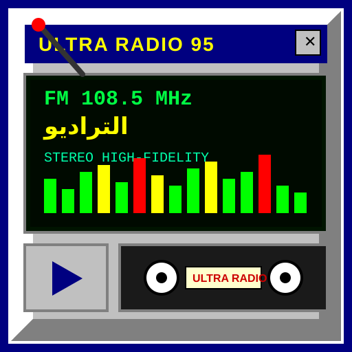

# 📻 الترادیو | ULTRA RADIO 95

<div align="center">



### 🎵 سامانه استریم زنده رادیو آنلاین رایگان با تم نوستالژیک دهه ۹۰ و ویندوز ۹۵
**Free Nostalgic 90s Retro Web Radio Player & Audio Visualizer**

[](https://reactjs.org/)
[](https://www.typescriptlang.org/)
[](https://tailwindcss.com/)
[](https://vitejs.dev/)
[](https://web.dev/progressive-web-apps/)
[](LICENSE)

**طراح و برنامه‌نویس:** سلمان حسین پور (Salman Hosseinpour)

[✨ ویژگی‌ها](#-ویژگی‌های-اصلی-key-features) • [📻 ایستگاه‌ها](#-ایستگاه‌های-رادیویی-live-stations) • [🎨 تم‌های اکولایزر](#-تم‌های-گرافیکی-اکولایزر-equalizer-skins) • [📲 نصب اپلیکیشن](#-قابلیت-نصب-pwa--add-to-home-screen) • [🚀 راه‌اندازی](#-نحوه-نصب-و-اجرا-getting-started)

---


</div>

## 📖 درباره پروژه (About The Project)

**الترادیو (Ultra Radio)** یک وب‌اپلیکیشن استریم زنده رادیو آنلاین رایگان و پرسرعت است که با الهام از رابط کاربری خاطره‌انگیز سیستم‌عامل **ویندوز ۹۵** و نرم‌افزار صوتی اسطوره‌ای **Winamp** طراحی و پیاده‌سازی شده است. این پروژه ترکیبی از حس نوستالژی طلایی وب دهه ۹۰ میلادی با جدیدترین تکنولوژی‌های مدرن وب (React 19, TypeScript, Tailwind CSS v4, Web Audio API, PWA) است.

---

## ✨ ویژگی‌های اصلی (Key Features)

### 🎧 ۱. پخش زنده و پایدار (Live High-Bitrate Audio)
- اتصال مستقیم به ۱۳ سرور اختصاصی استریم زنده با کیفیت صدای بالا (High-Fidelity Stereo Audio).
- مدیریت خطای هوشمند اتصال با مکانیزم اتصال مجدد خودکار (Auto-Reconnect).
- موتور پخش اختصاصی با پشتیبانی از کشف وضعیت شبکه، حالت لودینگ بافر و رفع محدودیت‌های پخش خودکار مرورگرها (Autoplay Restrictions).

### ⚡ ۲. دریافت لحظه‌ای متادیتای آهنگ‌ها (Real-Time Metadata)
- همگام‌سازی خودکار و زنده عنوان آهنگ (Track Title)، نام خواننده (Artist) و کاور ژانر هر چند ثانیه یک‌بار.
- نمایش وضعیت زنده پخش روی دیسک گردان وینیل و ال‌سی‌دی نوستالژیک.
- امکان جستجو و فیلتر سریع ایستگاه‌ها و آهنگ‌ها بر اساس ژانر و نام فارسی/انگلیسی.

### 🎨 ۳. پوسته و تم‌های گرافیکی اکولایزر (7 Retro Equalizer Skins)
- **وینمپ کلاسیک (Winamp 95 Classic):** نوارهای نوری سبز، زرد و قرمز با پس‌زمینه زیتونی.
- **کهربایی رترو ۸۰s (Amber Phosphor CRT):** درخشش مانیتورهای مونوکروم فسفری نارنجی.
- **نئون سایبرپانک (Cyberpunk 90s):** ترکیب رنگ‌های بنفش و فیروزه‌ای نئونی.
- **ماتریکس دیجیتال (Matrix Digital Code):** تم هکری سبز نئونی و کد بارانی.
- **سونی واکمن آبی (Sony Ice-Blue LCD):** نور پس‌زمینه ملایم ال‌سی‌دی‌های واکمن سونی.
- **آتشین و شعله (Blaze Inferno Fire):** زبانه شعله‌های سرخ و زرد متحرک.
- **عقربه‌ای آنالوگ (Analog Dual VU Meters):** عقربه‌های دوقلوی آنالوگ کلاسیک با انیمیشن واقعی نوسان صدا.

### 📊 ۴. حالت‌های متنوع بصری‌ساز صدا (3 Visualizer Modes)
- **LED Bars:** اسپکتروم چندکاناله میله‌ای ال‌ای‌دی با ۱۰ سگمنت عمودی.
- **Dual VU Meters:** عقربه‌های صوتی کالیبره شده بر اساس بیس و ولوم زنده.
- **Oscilloscope Wave:** اسیلوسکوپ موج سینوسی صوتی زنده با شبکه CRT.

### 📲 ۵. وب‌اپلیکیشن پیش‌رونده (PWA & Add to Home Screen)
- قابلیت نصب مستقیم روی صفحه اصلی گوشی (Android & iOS) و دسکتاپ بدون نیاز به اپ‌استور.
- اعلان خوش‌آمدگویی هوشمند (Smart Notification) هنگام ورود برای راهنمایی نصب.
- اجرای تمام‌صفحه (Standalone) بدون مزاحمت نوار آدرس مرورگر.
- آیکون اختصاصی و باکیفیت وکتور SVG رادیو ویندوز ۹۵.

### 🖥️ ۶. طراحی بدون اسکرول و وفادار به رترو (True Retro Win95 UI)
- ساختار Fixed Viewport (بدون اسکرول کلی صفحه و حفظ جایگاه ثابت کنترلرها).
- نوار متحرک نوستالژیک (90s Marquee Ticker) با سرعت اسکرول پیوسته.
- باتوم پلیر بار دائمی (Bottom Player Bar) همراه با کنترل ولوم، میوت، اسلایدر ترک، کلیدهای قبلی/بعدی و دسترسی سریع به ایستگاه‌ها.
- دکمه‌ها و پنجره‌های سه‌بعدی ویندوز ۹۵ (Bevels & Outsets).
- دیالوگ‌های راهنما و درباره ما (About) و تنظیمات اکولایزر ۱۰ کاناله.

---

## 📻 ایستگاه‌های رادیویی (Live Stations)

پلتفرم الترادیو شامل **۱۳ کانال رادیویی زنده** با سبک‌های مختلف است:

| ردیف | نام فارسی | نام لاتین | ژانر | کیفیت |
| :---: | :--- | :--- | :--- | :---: |
| **P1** | 🌟 رادیو پاپ خارجی | Pop Hits Radio | `pop` | 320 Kbps |
| **P2** | ☕ رادیو لوفای و چیل | Lo-Fi Chillout Station | `lofi` | 192 Kbps |
| **P3** | 🎤 رادیو هیپ‌هاپ و رپ فارسی | Hip-Hop & Persian Rap | `rap` | 320 Kbps |
| **P4** | 🎻 رادیو موسیقی اصیل و سنتی | Classic Persian Traditional | `sonati` | 256 Kbps |
| **P5** | 🎸 رادیو راک کلاسیک | Classic & Hard Rock FM | `rock` | 320 Kbps |
| **P6** | 🕺 رادیو فانک رترو | Retro Funk & Disco 80s | `funk` | 320 Kbps |
| **P7** | 🎷 رادیو سول و آراندبی | Soul & Vintage R&B | `soul` | 256 Kbps |
| **P8** | 🍃 رادیو امبینت و آرامش | Chillout & Ambient Waves | `chill` | 256 Kbps |
| **P9** | 🎬 رادیو موسیقی متن فیلم و انیمه | Cinema & Anime OST Radio | `ost` | 320 Kbps |
| **P10** | 🤠 رادیو کانتری و بلوز | Country Roads & Blues | `country` | 256 Kbps |
| **P11** | 🎺 رادیو جاز نیمه‌شب | Midnight Jazz Club | `jazz` | 320 Kbps |
| **P12** | ⚡ رادیو الکترونیک و دنس | Synthwave & EDM Station | `electronic` | 320 Kbps |
| **P13** | 🌙 رادیو ایندی و آلترناتیو | Indie & Alternative Vibes | `indie` | 256 Kbps |

---

## 🎨 تم‌های گرافیکی اکولایزر (Equalizer Skins)

شما می‌توانید پوسته ال‌سی‌دی و رقص‌نور را مطابق سلیقه خود تغییر دهید:

```
┌────────────────────────────────────────────────────────┐
│ [1] WINAMP 95 CLASSIC   - نوستالژی چراغ‌های ال‌ای‌دی سبز/زرد/قرمز │
│ [2] AMBER CRT PHOSPHOR  - نمایشگرهای لامپی تک‌رنگ کهربایی      │
│ [3] CYBERPUNK 90S NEON  - نورپردازی نئونی فیروزه‌ای و سرخ       │
│ [4] MATRIX DIGITAL CODE - کدنویسی هکری سبز ماتریکس             │
│ [5] SONY ICE-BLUE LCD   - نمایشگر یخی واکمن‌های صوتی ژاپنی    │
│ [6] BLAZE INFERNO FIRE  - شعله‌های آتشین و سرخ               │
│ [7] ANALOG DUAL VU      - عقربه‌های آنالوگ استریو L/R          │
└────────────────────────────────────────────────────────┘
```

---

## 📲 قابلیت نصب PWA (Add to Home Screen)

الترادیو به عنوان یک **Progressive Web App** استاندارد طراحی شده است:

### 📱 در گوشی‌های اندروید (Android / Chrome)
1. هنگام ورود به سایت، روی اعلان **«افزودن به هوم اسکرین (نصب)»** کلیک کنید.
2. یا از منوی سه نقطه مرورگر کروم گزینه **«Install app»** یا **«Add to Home screen»** را بزنید.

### 🍏 در گوشی‌های آیفون (iOS / Safari)
1. در مرورگر سافاری روی آیکون **Share (اشتراک‌گذاری ⎋)** در پایین صفحه بزنید.
2. گزینه **Add to Home Screen (+)** را انتخاب کنید.
3. در گوشه بالا روی **Add** کلیک نمایید.

### 💻 در کامپیوتر (Windows / macOS / Linux)
- در نوار آدرس مرورگر کروم یا اج روی آیکون **Install (⊕)** کلیک کنید.

---

## 🛠️ تکنولوژی‌های استفاده شده (Tech Stack)

- **Frontend Framework:** React 19 + TypeScript
- **Styling & Theme:** Tailwind CSS v4 (Windows 95 authentic look, inset/outset borders, retro bevels)
- **Icons:** Lucide React
- **Audio Engine:** HTML5 Web Audio API + Realtime Visualizer FFT Synthesizer
- **Backend Proxy & Server:** Express.js + Vite Dev Server
- **Build System:** Vite + ESBuild
- **PWA:** Web App Manifest + SVG Vector Icons + Standalone Viewport Configuration

---

## 🚀 نحوه نصب و اجرا (Getting Started)

برای اجرای پروژه روی سیستم شخصی خود مراحل زیر را دنبال کنید:

### ۱. کلون کردن ریپازیتوری
```bash
git clone https://github.com/your-username/ultra-radio.git
cd ultra-radio
```

### ۲. نصب وابستگی‌ها
```bash
npm install
# یا با yarn / pnpm / bun:
# bun install
```

### ۳. اجرای سرور توسعه (Development)
```bash
npm run dev
```
سپس مرورگر را باز کرده و به آدرس `http://localhost:3000` بروید.

### ۴. ساخت بیلد نهایی و پروداکشن (Production Build)
```bash
npm run build
npm start
```

---

## 📂 ساختار فایل‌های پروژه (Project Structure)

```
ultra-radio/
├── public/
│   ├── icon.svg             # آیکون وکتور اپلیکیشن برای PWA و Favicon
│   └── manifest.json        # تنظیمات وب‌اپلیکیشن پیش‌رونده (PWA)
├── src/
│   ├── components/
│   │   ├── AboutModal.tsx                 # پنجره اطلاعات درباره ما و شناسنامه پروژه
│   │   ├── BottomPlayerBar.tsx            # نوار پخش پایینی ثابت با تمام کنترل‌ها
│   │   ├── EqualizerModal.tsx             # پنجره تنظیمات ۱۰ کاناله اکولایزر و تم‌ها
│   │   ├── InstallModal.tsx               # پنجره راهنمای نصب PWA
│   │   ├── InstallNotificationBanner.tsx  # اعلان هوشمند ورود به سایت برای افزودن به هوم اسکرین
│   │   ├── MarqueeBanner.tsx              # نوار اخبار متحرک متنی دهه ۹۰
│   │   ├── StationGrid.tsx                # لیست شبکه‌ای ۱۳ ایستگاه و دیتابیس آهنگ‌ها
│   │   ├── TopTitleBar.tsx                # تایتل‌بار و منوهای سیستم ویندوز ۹۵
│   │   └── VisualizerScreen.tsx           # دک صوتی، کاور بزرگ و مانیتور اکولایزر
│   ├── data/
│   │   ├── eqThemes.ts      # تنظیمات و پالت‌های رنگی ۷ تم اکولایزر
│   │   └── stations.ts      # دیتابیس کانال‌ها و آدرس‌های استریم
│   ├── hooks/
│   │   ├── usePwaInstall.ts    # هوک مدیریت رویدادهای نصب PWA
│   │   ├── useRadioPlayer.ts   # هوک مدیریت پخش صوت، ولوم و داده‌های بصری‌ساز
│   │   └── useSongMetadata.ts  # هوک دریافت خودکار مشخصات آهنگ‌ها و کاورها
│   ├── App.tsx              # کامپوننت اصلی و روت
│   ├── index.css            # استایل‌های سراسری، پترن‌های ویندوز ۹۵ و اسکرول‌بارها
│   ├── main.tsx             # نقطه ورود فرانت‌اند
│   └── types.ts             # تعاریف تایپ‌های TypeScript
├── index.html               # فایل HTML اصلی همراه با متاتگ‌های PWA
├── package.json             # پکیج‌ها و اسکریپت‌های اجرایی
├── server.ts                # وب‌سرور Express
└── tsconfig.json            # کانفیگ TypeScript
```

---

## 👤 سازنده و توسعه‌دهنده (Author & Credits)

- **نسخه توسعه‌یافته وب‌اپ و اپلیکیشن‌های تمام پلتفرم‌ها:** ساخته دست **Hellboy Coder** (توسعه و بازطراحی اختصاصی برای Android, iOS, Web PWA)
- **طراحی اولیه:** سلمان حسین پور
- **پلتفرم:** الترادیو (Ultra Radio)
- **منبع استریم‌ها:** سرورهای اختصاصی Iran Stream Cloud (9craft)

---

## 📜 مجوز (License)

این پروژه تحت لایسنس [MIT](LICENSE) منتشر شده است و استفاده شخصی و آموزشی از آن آزاد می‌باشد.

---
**Crafted with passion by Hellboy Coder ⚡**

